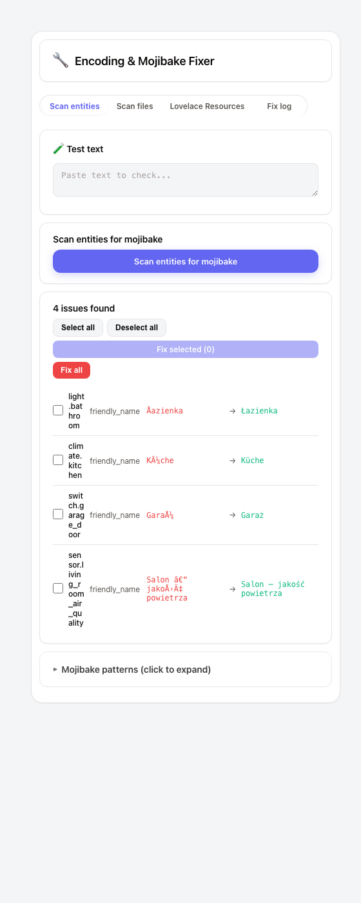
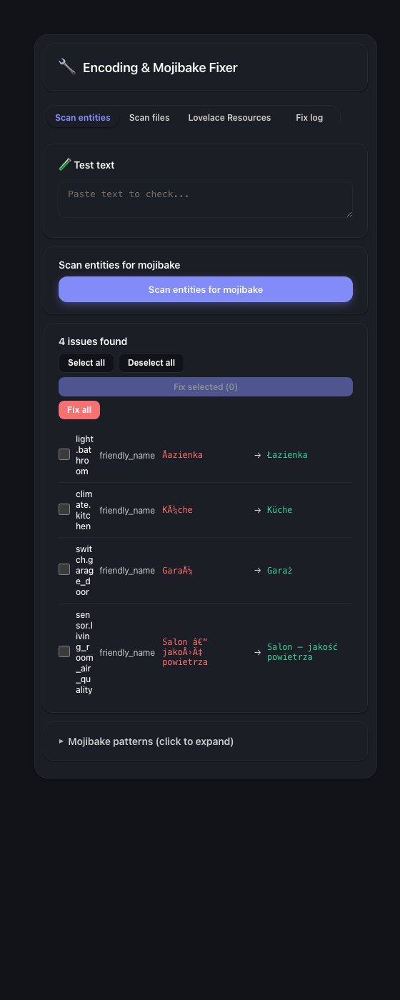

# Encoding Fixer


Find and safely repair UTF-8/mojibake text in selected Home Assistant YAML
files and entity-registry names. Encoding Fixer is local-only, administrator
only, and uses a preview → confirm → backup → validate → apply → verify
workflow.

[](https://www.home-assistant.io/) [](https://github.com/MacSiem/ha-encoding-fixer/releases) [](LICENSE)

Part of the [HA Tools](https://github.com/MacSiem) ecosystem.

## Safety model

Encoding Fixer does not accept filesystem paths from the browser. The backend
exposes a fixed logical allowlist:

- `configuration` → `configuration.yaml`
- `automations` → `automations.yaml`
- `scripts` → `scripts.yaml`
- `scenes` → `scenes.yaml`
- `packages` → regular `.yaml`/`.yml` files below `packages/`
- `entity_registry` → persistent entity-registry names through Home
  Assistant's entity-registry API

`secrets.yaml`, arbitrary files, encoded traversal, absolute/drive paths,
NUL-containing paths, symlinks, non-regular files and files over 2 MB are not
accepted. Filesystem work runs outside Home Assistant's event loop.

Every write follows the same contract:

1. Generate a short-lived preview tied to the current administrator.
2. Return only opaque change IDs, logical target IDs and line numbers.
   Raw YAML lines, file paths, entity IDs and entity names are not returned.
3. Re-check the exact source hash and selected change IDs.
4. Validate the complete proposed write set before creating file backups.
5. Back up every target before the first mutation.
6. Validate proposed YAML with Home Assistant's YAML parser.
7. Atomically replace files, fsync them and verify readback.
8. Roll back the complete changed set if any write or verification fails.

If a mixed file/entity apply is cancelled while a filesystem write is still
running, the integration waits for that bounded write to finish and restores
both halves before cancellation propagates. Unloading the final config entry
blocks new work, drains already-running operations and then removes the
in-memory workflow authority.

Apply and restore requests carry operation IDs. A retry of the same operation
returns its existing result; reusing that ID for a different request is
rejected.

## Privacy

- No telemetry, analytics, CDN assets or remote processing.
- No access token, REST fallback, shell command or direct browser-side entity
  registry mutation.
- No browser storage is used as an authority for previews, confirmations,
  backup IDs or operations.
- Backup listings expose only timestamp IDs and file counts.
- Client errors are generic; detailed diagnostics remain in local Home
  Assistant logs without configuration contents.
- Non-administrators see an explanation and the card makes no privileged
  requests. There is no reduced-permission or legacy fallback.

## What it detects

- Common UTF-8 text decoded as Latin-1, Windows-1252 or Windows-1250.
- A UTF-8 BOM at the beginning of an allowlisted YAML file.
- Python-style Unicode escape literals such as `\U0001F512`.

Detection is deliberately conservative. Suspicious strings that cannot be
repaired confidently are not offered as changes.

## Screenshots

| Light | Dark |
|---|---|
|  |  |

The repository screenshots use synthetic demo data. The current card may look
newer than these images while the security-focused workflow is being reviewed.

## Installation

### HACS custom repository

1. Open HACS → Integrations → menu → Custom repositories.
2. Add `https://github.com/MacSiem/ha-encoding-fixer` as an **Integration**.
3. Install **Encoding Fixer** and restart Home Assistant.
4. Open Settings → Devices & services → Add integration → **Encoding Fixer**.

### Dashboard card

The integration serves and registers its bundled card. Add:

```yaml
type: custom:ha-encoding-fixer
```

No manual Lovelace resource entry is required.

## Backups and restore

Before writing, the integration creates a timestamped backup below its own
directory in the Home Assistant configuration folder. The browser receives
only the backup ID, not its filesystem path or contents.

Restore accepts only a server-issued timestamp ID. It rejects backup contents
outside the same fixed allowlist, creates a rollback backup of the current
files first, restores all selected backup contents as one operation and
verifies the bytes. If restore fails, it attempts to restore the complete
pre-restore state. Restart Home Assistant after a successful restore.

Entity-registry fixes are made and rolled back through Home Assistant's
entity-registry API. Their backing-store backup is deliberately **not**
restored by the card while Home Assistant is running, because the in-memory
registry could overwrite it. Such a backup is marked as offline-recovery-only
and should be used only with Home Assistant stopped.

Backups can contain configuration and should be protected with the same file
permissions and retention policy as the Home Assistant configuration itself.
Encoding Fixer creates its backup root and operation directories with
owner-only permissions (`0700`), but cannot replace correct host ownership,
storage encryption or retention policy.

## Important limitations

- The integration repairs encoding artifacts; it does not decide whether a
  configuration value is semantically correct.
- A partial preview is labelled clearly. Unavailable, unsafe, oversized,
  binary or invalid UTF-8 targets are not modified.
- If automatic rollback cannot be verified, stop and inspect the local Home
  Assistant logs and the timestamped backup before retrying.
- The card and integration must come from the same release.

## Development checks

```bash
python -m tests
npm ci
npm run test:security
npm run test:smoke
npm audit --audit-level=high
```

The test suite covers traversal and symlink rejection, response redaction,
stale previews, complete pre-write validation, atomic and cancellation-safe
rollback, unload fail-closed behavior, admin-only commands, integration-only
UI behavior, readable responsive layout and root/bundled card parity.

## Support

- [Buy Me a Coffee](https://buymeacoffee.com/macsiem)
- [PayPal](https://www.paypal.com/donate/?hosted_button_id=Y967H4PLRBN8W)

## License

MIT — see [LICENSE](LICENSE).
