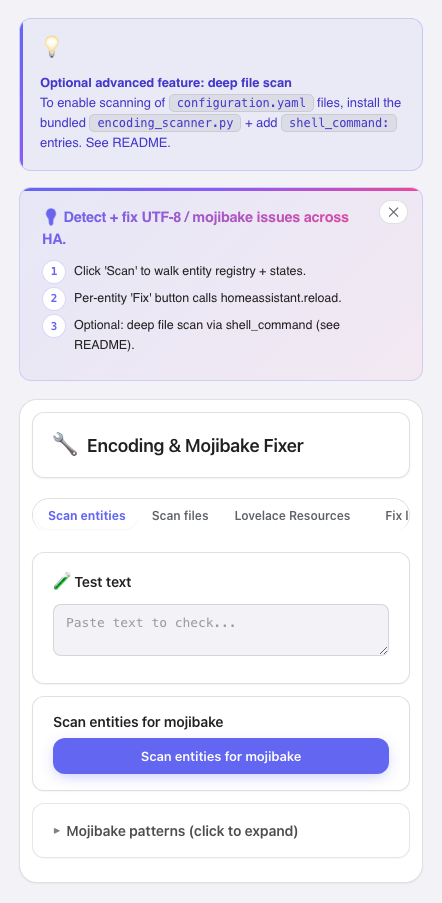

# Encoding Fixer

Fix UTF-8/mojibake text in Home Assistant YAML config files and entity registry friendly names.


## Screenshot



## Installation

Until this repository is accepted into the default HACS list, install it as a custom repository:

1. Open HACS -> Custom repositories.
2. Add `https://github.com/MacSiem/ha-encoding-fixer`.
3. Select category: **Integration**.
4. Install **Encoding Fixer**.
5. Restart Home Assistant.
6. Go to Settings -> Devices & services -> Add integration -> **Encoding Fixer**.

The integration registers the bundled Lovelace card automatically. Add it to a dashboard with:

```yaml
type: custom:ha-encoding-fixer
```

## Backup First

Every server-side write creates a timestamped backup before changing anything.

Backups are stored under:

```text
<config>/ha_encoding_fixer_backups/<YYYYMMDD-HHMMSS>/<relative-path>
```

File fixes back up the target YAML file before writing. Entity registry name fixes use the Home Assistant entity registry API and back up `.storage/core.entity_registry` before the registry update. Restores also back up the current target file before replacing it from a chosen backup.

If a write verification fails, the integration restores the just-created backup for that file and returns an error in the WebSocket response.

## Dry Run Default

The `ha_encoding_fixer/fix` WebSocket command defaults to `dry_run: true`.

The card always runs a dry run first, shows the full change list in a confirmation dialog, and only then offers **Apply for real**. A dry run returns changes with `file`, `line`, `before`, and `after` fields and does not write files or entity registry data.

## What It Scans

- YAML/YML files under the Home Assistant config directory.
- Entity registry friendly names.
- BOM at the start of YAML files.
- Common UTF-8 decoded as Latin-1/Windows-1252/Windows-1250 mojibake patterns.
- Python-style Unicode escape literals such as `\U0001F512` and `\u0142`.

## Restore

Use the card's restore section to list server backups and restore a selected backup directory. Restore copies every file in the selected backup directory back to its original relative path and verifies the copied bytes.

Home Assistant restart may be needed after restoring `.storage` files.

## Migration From v4 Lovelace Plugin

Version 5.0.0 changes this repository from a Lovelace-card-only HACS plugin to a Home Assistant integration with a bundled card.

After installing the integration, remove the old manual Lovelace resource entry for:

```text
/local/community/ha-encoding-fixer/ha-encoding-fixer.js
```

The root `ha-encoding-fixer.js` remains as a transitional/legacy card copy. The integration-served card is bundled at:

```text
custom_components/ha_encoding_fixer/www/ha-encoding-fixer-card.js
```

If the card is loaded without the integration configured, it falls back to the previous limited client/REST behavior and shows a legacy-mode hint.

## Privacy

- No telemetry.
- No analytics.
- No CDN-hosted assets.
- Server-side scans read only files under Home Assistant's config directory.

## License

MIT - see [LICENSE](LICENSE).
